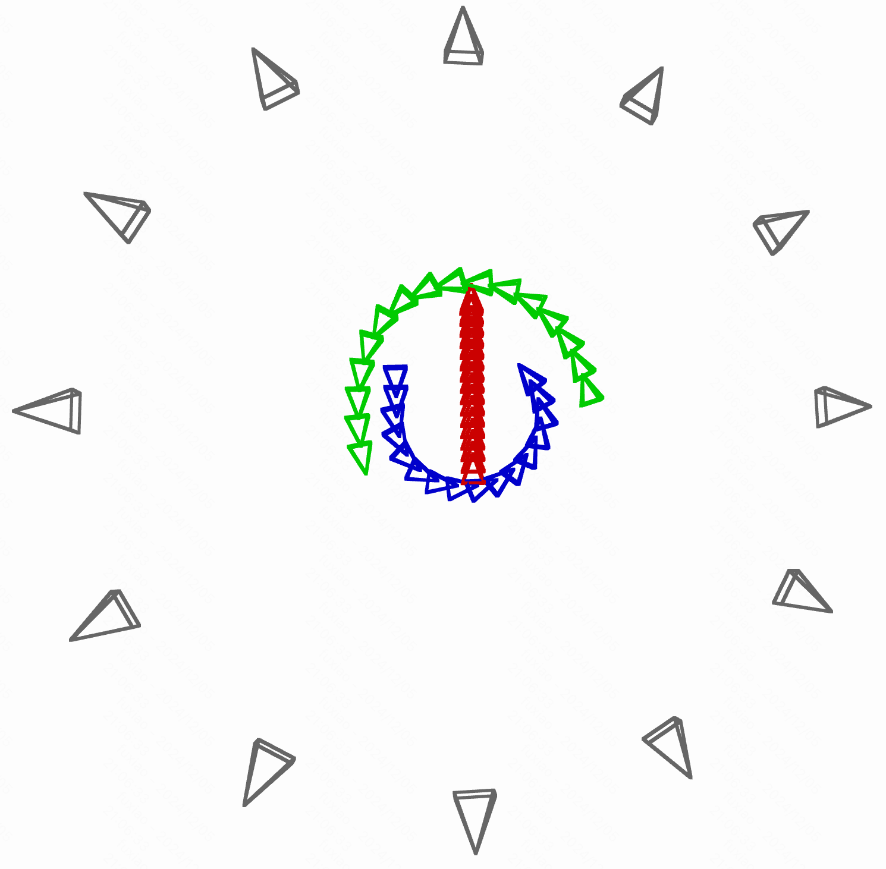

## ___***3DTrajMaster: Mastering 3D Trajectory for Multi-Entity Motion in Video Generation***___
<div align="center">
</img>

 &nbsp;
 <a href='http://fuxiao0719.github.io/projects/3dtrajmaster'></a> &nbsp;
 <a href='https://arxiv.org/pdf/2412.07759'></a> &nbsp;
 <a href='https://huggingface.co/datasets/KwaiVGI/360Motion-Dataset'></a> &nbsp;
  <a href='https://huggingface.co/KwaiVGI/3DTrajMaster'></a> &nbsp;

**[Xiao Fu<sup>1 &dagger;</sup>](https://fuxiao0719.github.io/), 
[Xian Liu<sup>1</sup>](https://alvinliu0.github.io/), 
[Xintao Wang<sup>2 &#9993;</sup>](https://xinntao.github.io/), 
[Sida Peng<sup>3</sup>](https://pengsida.net/), 
[Menghan Xia<sup>2</sup>](https://menghanxia.github.io/), 
[Xiaoyu Shi<sup>2</sup>](https://xiaoyushi97.github.io/), 
[Ziyang Yuan<sup>2</sup>](https://scholar.google.ru/citations?user=fWxWEzsAAAAJ&hl=en), <br>
[Pengfei Wan<sup>2</sup>](https://scholar.google.com/citations?user=P6MraaYAAAAJ&hl=en)
[Di Zhang<sup>2</sup>](https://openreview.net/profile?id=~Di_ZHANG3),
[Dahua Lin<sup>1&#9993;</sup>](http://dahua.site/)** 
<br>
<sup>1</sup>The Chinese University of Hong Kong
<sup>2</sup>Kuaishou Technology
<sup>3</sup>Zhejiang University
<br>
&dagger;: Intern at KwaiVGI, Kuaishou Technology, &#9993;: Corresponding Authors

**ICLR 2025**

</div>

## 🌟 Introduction

🔥 3DTrajMaster controls **one or multiple entity motions in 3D space with entity-specific 3D trajectories** for text-to-video (T2V) generation. It has the following features:
- **6 Domain of Freedom (DoF)**: control 3D entity location and orientation.
- **Diverse Entities**: human, animal, robot, car, even abstract fire, breeze, etc.
- **Diverse Background**: city, forest, desert, gym, sunset beach, glacier, hall, night city, etc.
- **Complex 3D trajectories**: 3D occlusion, rotating in place, 180°/continuous 90° turnings, etc.
- **Fine-grained Entity Prompt**: change human hair, clothing, gender, figure size, accessory, etc.

https://github.com/user-attachments/assets/efe1870f-4168-4aff-98b8-dbd9e3802928

🔥 **Release News**
- `[2025/01/23]` 3DTrajMaster is accepted to ICLR 2025.
- `[2025/01/22]` Release inference and training codes based on CogVideoX-5B.
- `[2024/12/10]` Release [paper](https://arxiv.org/pdf/2412.07759), [project page](http://fuxiao0719.github.io/projects/3dtrajmaster), [dataset](https://huggingface.co/datasets/KwaiVGI/360Motion-Dataset), and [eval code](https://github.com/KwaiVGI/3DTrajMaster).

## ⚙️ Quick Start

> **(1) Access to Our Internal Video Model**

As per company policy, we may not release the proprietary trained model at this time. However, if you wish to access our internal model, please submit your request via (1) [a shared document](https://docs.google.com/spreadsheets/d/1HL96IS33fyzrDeXTt3hJ80ZsnfRBzDoKh8wparoBAGI/edit?pli=1&gid=0#gid=0) or (2) directly via email (`lemonaddie0909@gmail.com`); we will respond to requests with the generated video as quickly as possible.
Please ensure your request includes the following:

1. Entity prompts (1–3, with a maximum of 42 tokens, approximately 20 words per entity)
2. Location prompt
3. Trajectory template (you can refer to the trajectory template in our released 360°-Motion Dataset, or simply describe new ones via text)

> **(2) Access to Publicly Available Codebase**

We open-source a model based on CogVideoX-5B. Below is a comparison between CogVideoX and our internal video model as of 2025.01.15.

https://github.com/user-attachments/assets/a49e46d3-92d0-42ec-a89f-a9d43919f620


#### Inference
1. **[Environment Set Up]** Our environment setup is identical to [CogVideoX](https://github.com/THUDM/CogVideo). You can refer to their configuration to complete the environment setup.

    ```bash
    conda create -n 3dtrajmaster python=3.10
    conda activate 3dtrajmaster
    pip install -r requirements.txt
    ```

2. **[Download Weights and Dataset]** Download the pretrained checkpoints (CogVideo-5B, LoRA, and injector) from [here](https://huggingface.co/KwaiVGI/3DTrajMaster) and place them in the `weights` directory. Then, download the dataset from [here](https://huggingface.co/datasets/KwaiVGI/360Motion-Dataset). Please note that in both training stages, we use only 11 camera poses and exclude the last camera pose as the novel pose setting.

3. **[Inference on Generalizable Prompts]** Change root path to `inference`. Note a higher LoRA scale and more annealed steps can improve accuracy in prompt generation but may result in lower visual quality. For entity input, you can use GPT to enhance the description to an appropriate length, such as "Generate a detailed description of approximately 20 words".

    ```bash
    python 3dtrajmaster_inference.py \
        --model_path ../weights/cogvideox-5b \
        --ckpt_path ../weights/injector \
        --lora_path ../weights/lora \
        --lora_scale 0.6 \
        --annealed_sample_step 20 \
        --seed 24 \
        --output_path output
    ```

    | Argument                | Description |
    |-------------------------|-------------|
    | `--lora_scale`            | LoRA alpha weight. Options: 0-1, float. Default: 0.6. |
    | `--annealed_sample_step`  | annealed sampling steps during inference. Options: 0-50, int. Default: 20. |
    | Generalizable Robustness  | prompt entity number: 1>2>3 |
    | Entity Length  | 15-24 words, ~24-40 tokens after T5 embeddings |

    The following code snapshot showcases the core components of 3DTrajMaster, namely the plug-and-play 3D-motion grounded object injector.

    ```python
    # 1. norm & modulate
    norm_hidden_states, norm_empty_encoder_hidden_states, gate_msa, enc_gate_msa = self.norm1(hidden_states, empty_encoder_hidden_states, temb)
    bz, N_visual, dim = norm_hidden_states.shape
    max_entity_num = 3
    _, entity_num, num_frames, _ = pose_embeds.shape

    # 2. pair-wise fusion of trajectory and entity
    attn_input = self.attn_null_feature.repeat(bz, max_entity_num, 50, num_frames, 1)
    pose_embeds = self.pose_fuse_layer(pose_embeds)
    attn_input[:,:entity_num,:,:,:] = pose_embeds.unsqueeze(-3) + prompt_entities_embeds.unsqueeze(-2)
    attn_input = torch.cat((
        rearrange(norm_hidden_states, "b (n t) d -> b n t d",n=num_frames), 
        rearrange(attn_input, "b n t f d -> b f (n t) d")),
        dim=2
    ).flatten(1,2)

    # 3. gated self-attention
    attn_hidden_states, attn_encoder_hidden_states = self.attn1_injector(
        hidden_states=attn_input,
        encoder_hidden_states=norm_empty_encoder_hidden_states,
        image_rotary_emb=image_rotary_emb,
    )
    attn_hidden_states = attn_hidden_states[:,:N_visual,:]

    hidden_states = hidden_states + gate_msa * attn_hidden_states
    ```

#### Training

1. Change root path to `finetune`. First, train lora module to fit the synthetic data domain.

    ```bash
    bash finetune_single_rank_lora.sh
    ```

2. Then, train injector module to learn the entity motion controller. Here we set `--block_interval` to 2 to insert the injector every 2 transformer blocks. You can increase this value for a lighter model, but note that it will require a longer training time. For the initial fine-tuning stage, use `--finetune_init`. If resuming from a pre-trained checkpoint, omit `--finetune_init` and specify `--resume_from_checkpoint $TRANSFORMER_PATH` instead. Note that in both training stages, we use only 11 camera poses and exclude the last camera pose as the novel pose setting.

    ```bash
    bash finetune_single_rank_injector.sh
    ```

## 📦 360°-Motion Dataset ([Download 🤗](https://huggingface.co/datasets/KwaiVGI/360Motion-Dataset))
 ```
  ├── 360Motion-Dataset                      Video Number        Cam-Obj Distance (m)
    ├── 480_720/384_672
        ├── Desert (desert)                    18,000               [3.06, 13.39]
            ├── location_data.json
        ├── HDRI                                                      
            ├── loc1 (snowy street)             3,600               [3.43, 13.02]
            ├── loc2 (park)                     3,600               [4.16, 12.22]
            ├── loc3 (indoor open space)        3,600               [3.62, 12.79]
            ├── loc11 (gymnastics room)         3,600               [4.06, 12.32]
            ├── loc13 (autumn forest)           3,600               [4.49, 11.92]
            ├── location_data.json
        ├── RefPic
        ├── CharacterInfo.json
        ├── Hemi12_transforms.json
  ```

> **(1) Released Dataset Information (V1.0.0)**

| Argument                | Description |Argument                | Description |
|-------------------------|-------------|-------------------------|-------------|
| **Video Resolution**    | (1) 480×720 (2) 384×672    |       **Frames/Duration/FPS**        | 99/3.3s/30  |
| **UE Scenes**    | 6 (1 desert+5 HDRIs)  |       **Video Samples**        | (1) 36,000 (2) 36,000 |
| **Camera Intrinsics (fx,fy)**    | (1) 1060.606 (2) 989.899 |       **Sensor Width/Height (mm)**        | (1) 23.76/15.84 (2) 23.76/13.365 |
| **Hemi12_transforms.json**    | 12 surrounding cameras |      **CharacterInfo.json**        | entity prompts  |
| **RefPic**    | 50 animals     |       **1/2/3 Trajectory Templates**       | 36/60/35 (121 in total) |
| **{D/N}_{locX}** | {Day/Night}_{LocationX} |  **{C}_ {XX}_{35mm}** | {Close-Up Shot}_{Cam. Index(1-12)} _{Focal Length}|

**Note that** the resolution of 384×672 refers to our internal video diffusion resolution. In fact, we render the video at a resolution of 378×672 (aspect ratio 9:16), with a 3-pixel black border added to both the top and bottom.

> **(2) Difference with the Dataset to Train on Our Internal Video Diffusion Model**

The release of the full dataset regarding more entities and UE scenes is still under our internal license check.

|  Argument              | Released Dataset |       Our Internal Dataset|
|-------------------------|-------------|-------------------------|
| **Video Resolution**    | (1) 480×720 (2) 384×672 |       384×672     |
| **Entities**    | 50 (all animals)     |      70 (20 humans+50 animals)  |
| **Video Samples**    | (1) 36,000 (2) 36,000   |    54,000   |
| **Scenes**    | 6  |   9 (+city, forest, asian town)  |
| **Trajectory Templates**    | 121 |   96  |

> **(3) Load Dataset Sample**

1. Change root path to `dataset`. We provide a script to load our dataset (video & entity & pose sequence) as follows. It will generate the sampled video for visualization in the same folder path.

    ```bash
    python load_dataset.py
    ```

2. Visualize the 6DoF pose sequence via Open3D as follows:

    ```bash
    python vis_trajecotry.py
    ```
    After running the visualization script, you will get an interactive window like this. Note that we have converted the right-handed coordinate system (Open3D) to the left-handed coordinate system in order to better align with the motion trajectory of the video:

    


## 🚀 Benchmark Evaluation (Reproduce Paper Results)
  ```
  ├── eval
    ├── GVHMR
    ├── common_metrics_on_video_quality
  ```

> **(1) Evaluation on 3D Trajectory**

1. Change root path to `eval/GVHMR`. Then follow [GVHMR](https://github.com/zju3dv/GVHMR/blob/main/docs/INSTALL.md) installation to prepare the setups and  (recommend using a different Conda environment to avoid package conflicts). Our evaluation input is available at [here](https://drive.google.com/file/d/1DLWioJtvv9u4snybu5DrteVWma12JXq3/view?usp=drive_link). Please note that the 3D trajectories have been downsampled from 77 frames to 20 frames to match the RGB latent space of the 3D VAE.

2. Download the [inference videos](https://drive.google.com/file/d/1jMH2-ZC0ZBgtqej5Sp-E5ebBIX7mk3Xz/view?usp=drive_link) generated by our internal video diffusion model and corresponding [evalution GT poses](https://drive.google.com/file/d/1iFcPSlcKb_rDNJ85UPoThdl22BqR2Xgh/view?usp=drive_link) by using this command (you can check the 3D evaluated trajectory via our provided visualization script):
    ```bash
    bash download_eval_pose.sh
    ```

3. Estimation of human poses on evaluation sets:
    ```bash
    python tools/demo/demo_folder.py -f eval_sets -d outputs/eval_sets_gvhmr -s
    ```

4. Evaluation of all human samples (note to convert the left and right hand coordinate systems) :
    ```bash
    python tools/eval_pose.py -f outputs/eval_sets_gvhmr
    ```

> **(2) Evaluation on Visual Quality**

1. Change root path to `eval/common_metrics_on_video_quality`. Then download [fvd](https://drive.google.com/file/d/1U2hd6qvwKLfp7c8yGgcTqdqrP_lKJElB/view?usp=drive_link), [inference videos](https://drive.google.com/file/d/1jMH2-ZC0ZBgtqej5Sp-E5ebBIX7mk3Xz/view?usp=drive_link) and [base T2V inference videos](https://drive.google.com/file/d/1kfdCDA5koYh9g3IkCCHb4XPch2CJAwek/view?usp=drive_link) using the download script:
    ```bash
    bash download_eval_visual.sh
    ```

2. Evaluation of FVD, FID, and CLIP-SIM metrics.
    ```bash
    pip install pytorch-fid  clip
    bash eval_visual.sh
    ```

## 📚 Related Work

- [MotionCtrl](https://github.com/TencentARC/MotionCtrl): the first to control 3D camera motion and 2D object motion in video generation
- [TC4D](https://sherwinbahmani.github.io/tc4d/): compositional text-to-4D scene generation with 3D trajectory conditions
- [Tora](https://ali-videoai.github.io/tora_video/): control 2D motions in trajectory-oriented diffusion transformer for video generation
- [SynCamMaster](https://jianhongbai.github.io/SynCamMaster/): multi-camera synchronized video generation from diverse viewpoints
- [StyleMaster](https://zixuan-ye.github.io/stylemaster): enable artistic video generation and translation with reference style image

####

## 🔗 Citation
If you find this work helpful, please consider citing:
```BibTeXw
@inproceedings{fu20243dtrajmaster,
  title={3DTrajMaster: Mastering 3D Trajectory for Multi-Entity Motion in Video Generation},
  author={Fu, Xiao and Liu, Xian and Wang, Xintao and Peng, Sida and Xia, Menghan and Shi, Xiaoyu and Yuan, Ziyang and Wan, Pengfei and Zhang, Di and Lin, Dahua},
  booktitle={ICLR},
  year={2025}
}
```
